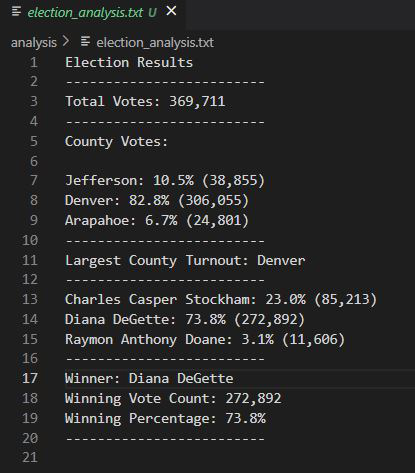

# Module 3 Challenge – Election Analysis
## Overview of Election Audit
**#Purpose**

    The purpose of the election analysis is to help the election commission gather additional
    
    data to complete their audit and provide them with the voter turnout for each county, the percentage 
    
    of votes from each county out of the total count, and the county with the highest turnout.
# Election Audit Results
    •	There were 369,711 total votes cast in this congressional election.
    
    •	The number of votes and the percentage of total votes for each county in the precinct are as follows:
    
                o	Jefferson: 10.5% (38,855)
                
                o	Denver: 82.8% (306,055)
                
                o	Arapahoe: 6.7% (24,801)
    
    •	The county with the largest number of votes, 306,055, was Denver. 
     
    •	The candidates in this congressional election are: 
                
                o	Charles Casper Stockham- he received  a total of 85,213 (23.0%) votes.  
                
                o	Diana DeGette- she received a total of  272,892 (73.8%) votes.
                
                o	Raymon Anthony Doane- he received a total 11,606 (3.1%) votes.
    
    •	The candidate who won the election with a winning vote count of 272,892 and 73.8% of the 
    
         total votes was Diana DeGette. 

# Election Audit Summary

    If you take a look at the image down below, you’ll see that we were able to provide the election 
    
    commission with a lot more additional information to complete their audit using the existing 
    
    information provided. The script used is quite versatile and can be reused to any election to suit their 
    
    needs, with minor modifications. For example, the easiest method would be to simply open and read 
    
    from a different .csv file or one could add to the existing .csv file to include more information like 
    
    other candidates or counties. 

    'Show Images
     

